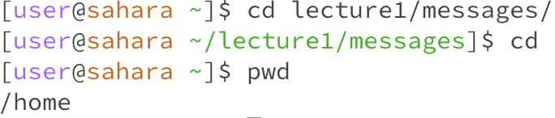
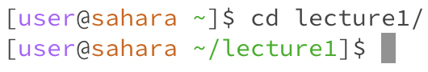
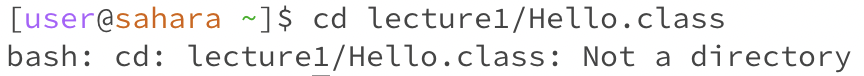
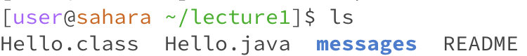
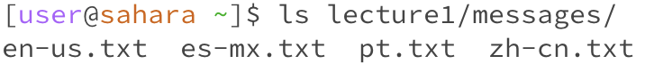
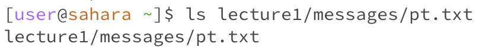
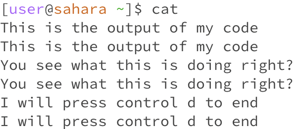
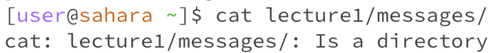
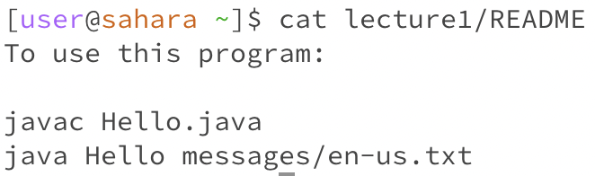

# Lab Report 1
## Remote Access and File System

`cd` **command**
---
1. 
   - The working directory when the command was run was the `messages` directory.
   - The `cd` command without any arguments moves us to the `home` directory from the previous directory we were in.
     In this case we move from the `messages` directory to the `home` directory.
   - From the next line we can see that there is not other directory name next to the `~`, meaning we are in the `home` directory.   
2. 
   - The working directory when the command was run was the `home` directory.
   - We got this output because the `cd` command changes the current directory to a specific directory given by the directory name            listed next to the `cd` command.  
   - The output on the next line was `lecture1` next to the `~`, which means that `lecture1` became the working directory which
     is the correct output.
3. 
   - The working directory when the command was run was the `home` directory.
   - This was the resulting output because the file `Hello.class` is not a directory, meaning it cannot be accessed by the cd command.
   - This output is not an error, however the input is an error because I should be using the `cat` command to access a file.
  
`ls` **command**
---
1. 
   - The working directory when the command was run was the `lecture1` directory.
   - We received this output because the `ls` command lists the contents of the current working directory.
   - The output is correct as all of the files and directories listed were in the `lecture1` directory.
2. 
   - The working directory when the command was run was the `home` directory.
   - We received this output because the path written led to the `messages` directory. All the contents listed were a part of the
     `messages` directory.
   - The output is correct as all of these files are kept in the `messages` directory.
3. 
   - The working directory when the command was run was the `home` directory.
   - We recived this output because the `ls` command lists contents of a directory, but in this case we tried to use `ls` for a file.
   - The output is an error because `ls` only lists the contents of a directory and the file `pt.txt` is not a directory.
  
`cat` **command**
--- 
1. 
   - The working directory when the command was run was the `home` directory.
   - We received this output because when the `cat` command is ran with no arguements it waits for input from the user, and proceeds to       display what the user entered until the user presses `control D`.
   - The output is correct as everything the user inputted was correctly outputted until `control D` was typed.
2. 
   - The working directory when the command was run was the `home` directory.
   - We received this output because the path written was to the `messages` directory, but `cat` is used to access
     contents in a flie.
   - The output resulted in an error message because `cat` should only be used to access the contents in a file not
     in a directory such as `messages`.
3. 
   - The working directory when the command was run was the `home` directory.
   - We received this ouput because the `cat` command provides the contents that are within the file passed in the arguemnt.
   - The output is correct as the contents listed match the contents in the file when opened. 
   
