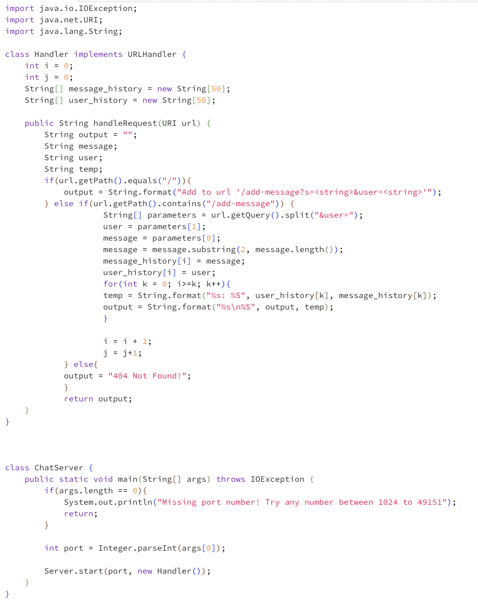
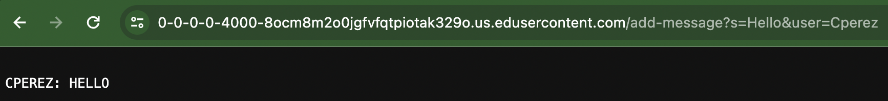
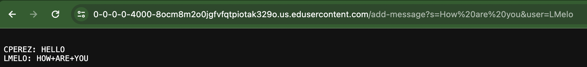

#Lab Report 2

##Part 1:
---
`ChatServer` Code:

`/add-message` example 1:

* The method that is called in my `ChatServer` code is the `public String handleRequest(URI url)` method and the `public static void main(String[] args) throws IOException` method.
* The relevant arguemnts in these methods are "CPerez" and "Hello" as these represent the values of `User` and `message` in the `public String handleRequest(URI url)` method. The values of `String message`, `String user`, `String temp`, `int i`, `iny j`, `String[] message_history`, `String[] user_history`, and `String output` are:
  - "Hello", "Cperez", "Cperez: Hello", "0", "0", "['Hello']", "['Cperez']", and "Cperez: Hello"
* The values that change from this specific request are:
  - `message`, `user`, `temp`, `message_history`, `user_history`, and `output`
  - They change by starting with `""` as the value and then change depending on arguemnts passed in url.  
`/add-message` example 2:

* The method that is called in my `ChatServer` code is the `public String handleRequest(URI url)` method and the `public static void main(String[] args) throws IOException` method.
* The relevant arguemnts in these methods are "CPerez", "LMelo", "How are you", and "Hello" as these represent the values of `User` and `message` in the `public String handleRequest(URI url)` method. The values of `String message`, `String user`, `String temp`, `int i`, `iny j`, `String[] message_history`, `String[] user_history`, and `String output` are:
  - "How are you", "LMelo", "LMelo: How are you", "1", "1", "['Hello', 'How are you]", "['Cperez', 'LMelo']", and "Cperez: Hello \nLMelo: How are you"

##Part 2:

##Part 3: Something I leanred from lab in week 2 was how to launch web servers as well as how to use url paths to manipulate the server to output my desired prompts. During Lab 2, we used java files such as `Server.java` and `NumberServer.java` to launch the web server and pass the url arguments to update the outputs of the page. Also learning how to launch the web server from the command line and execute java commands using `javac` to run the java files and `java` to run the classes in the files. This all helps me understand how things such as a simple search on google works as the arguments are passed at the end of the url such as the one in part one of this blog. 
