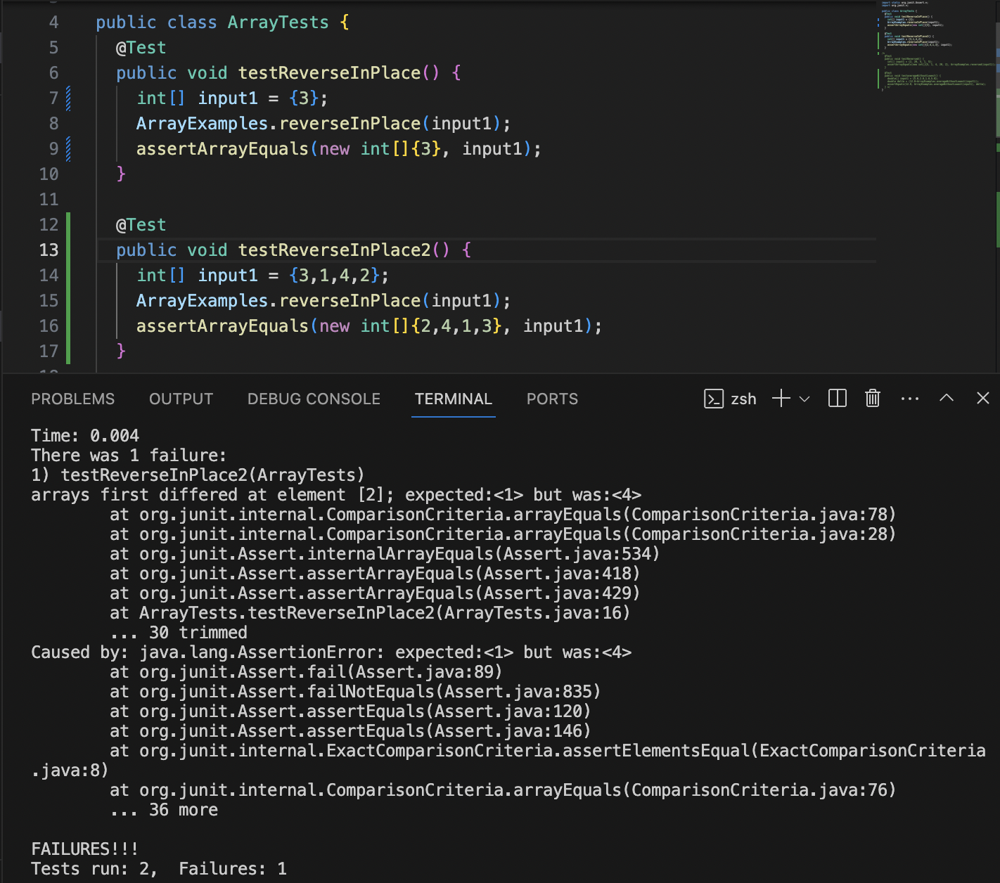

# Lab Report 3
## Part 1 - Bugs
---
### The bug I chose was of `static void reverseInPlace(int[] arr)` method in the `ArrayExamples` class. 
1. Failure-Inducing Input:
  - `@Test 
	  public void testReverseInPlace() {
      int[] input1 = {3, 5, 2, 4, 1};
      ArrayExamples.reverseInPlace(input1);
      assertArrayEquals(new int[]{1, 4, 2, 5, 3}, input1);
	  }`
2. Non Failure-Inducing Input: 
  - `@Test 
	  public void testReverseInPlace() {
      int[] input1 = {3};
      ArrayExamples.reverseInPlace(input1);
      assertArrayEquals(new int[]{3}, input1);
	  }`
3. The Symptom: 

4. The Bug: 
	Before => `static void reverseInPlace(int[] arr) {
    			for (int i = 0; i < arr.length / 2; i += 1) {
      				int temp = arr[i];
      				arr[i] = arr[arr.length - i - 1];
    			}
  		  }`
	After => `static void reverseInPlace(int[] arr) {
    			for (int i = 0; i < arr.length / 2; i += 1) {
      				int temp = arr[i];
      				arr[i] = arr[arr.length - i - 1];
      				arr[arr.length - i - 1] = temp;
    			}
  		  }`
Explanation: So the bug was that in the before code, the variable `temp` was not being used at all as it was temporarily storing the integer values of the ith element of the array. In the After code it was used to switch the ith element with its `arr.length-i-1` counterpart in the array. 

## Part 2 - Researching Commands
---
### `Find` Command
The `find` command is a terminal command you type to execute a certain task, in this case it will start in the working directory and iteratively search through the directory and its' subdirectories for the file passed as a parameter to be found. 
1. `- delete` option:
   - What this command does is it deletes the file that is searched for by the find command.
   	* Example: `Before: ls /User/winter2024: wavelet Plain.txt
   		    Input: find /User/winter2024/Plain.txt -delete
   	  	    Output: ls /User/winter2024: wavelet`
   	* Example: `Before: ls /User/winter2024: wavelet Plain.txt Humor.txt Surface.txt test.sh
   		    Input: find /User/winter2024 -name "*.txt" -delete
   	  	    Output: ls /User/winter2024: wavelet test.sh`
	- In the first example the path name is given to `find /Path/to/file -delete` to search for `Plain.txt` in the winter2024 		direcotry and its subdirectories. Then the file is deleted which is what is shown when ouputing with the ls command of 			winter2024.
 	- In the second example the path name is given to `find /Path/to/directory -name "*.txt" -delete` to search for all files in the 	given direcotry and its subdictoreiss with `.txt` in the name and delete them. This is why the output is now just `wavelet` and 	`test.sh` as the other text files were deleted.
2. `- empty` option:
   - What this command does is it checks for empty files or directories in the current working direcotry and subdirectories and prints them. For the examples wavelet is empty. 
   	* Example: `Before: ls /User/winter2024: wavelet Plain.txt
   		    Input: find /User/winter2024/ -empty
   	  	    Output: /User/winter2024/wavelet`
   	* Example: `Before: ls /User/winter2024: notEmpty Plain.txt Humor.txt Surface.txt test.sh
   		    Input: find /User/winter2024 -delete
   	  	    Output: `
	- In the first example the path name is given to `find /Path/to/directory -empty` to search for empty directories and files in 		  winter2024 and its subdirectories. The the empty files and directories are listed as the output, in this case `wavelet` is 		  empty so it is printed. 
 	- In the second example the path name is given to `find /Path/to/directory -empty` to search for all files in the given 		  directory and its subdictoreiss that are empty. This is why the output is nothing as none of the files and directories in 		  winter2024 are empty.
3. `- print` option:
   - What this command does is it recursively searches for all directories and files starting from the working directory and prints 	  out all the paths.
   	* Example: `Before: ls /User/winter2024: wavelet Plain.txt
   		    Input: find /User/winter2024 -print
   	  	    Output: /User/winter2024
   	  		    /User/winter2024/wavelet
   	  		    /User/winter2024/Plain.txt`
   	* Example: `Before: ls /User/winter2024: wavelet Plain.txt Humor.txt Surface.txt test.sh
   		    Input: find /User/winter2024 -name "*.txt" -print
   	  	    Output: /User/winter2024/Plain.txt
   	  		    /User/winter2024/Humor.txt
   	  		    /User/winter2024/Surface.txt
   	  		    /User/winter2024/test.sh`
	- In the first example the path name is given to `find /Path/to/file -print` to search for all direcotires and files in the 		  winter2024 directory. Then the directory and path names are listed starting with the working directory. 
 	- In the second example the path name is given to `find /Path/to/directory -name "*.txt" -print` to search for all files in the 	  given direcotry and its subdictoreiss with `.txt` in the name. Then it ouputs all the path names of the files that match this 	  criteria.
4. `- ls` option:
   - What this command does is it recursively searches for all directories and files starting from the working directory and prints 	  out information on the files and directories.
   	* Example: `Before: ls /User/winter2024: 
   		    Input: find /User/winter2024 -ls 
   	  	    Output: 21386962        0 drwxr-xr-x    4 cesar_12         staff                 128 Feb 13 16:10 winter2024`
   	* Example: `Before: ls /User/winter2024: wavelet 
   		    Input: find /User/winter2024/wavelet type d -ls
   	  	    Output: 21386962        0 drwxr-xr-x    4 cesar_12         staff                 128 Feb 13 16:10 winter2024
   	  		    22261540        0 drwxr-xr-x   11 cesar_12         staff                 352 Jan 25 11:40 winter2024/wavelet`
	- In the first example the path name is given to `find /Path/to/directory -ls` to search for all direcotires and files in the 		  winter2024 directory. Then information about the directories and files in the current working directory is printed. 
 	- In the second example the path name is given to `find /Path/to/directory type d -ls` to search for directories in the 	  	  given direcotry and its subdirectories. Then it ouputs information about the directories.
  	

