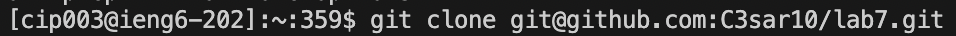
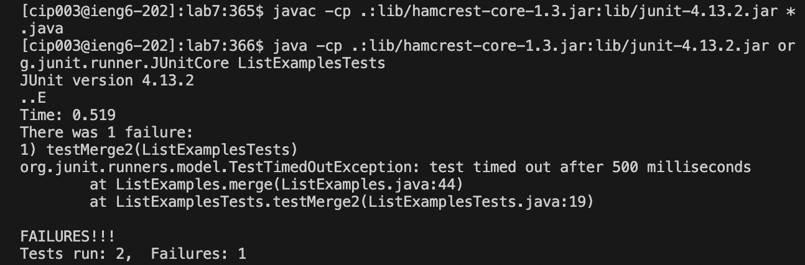
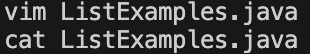
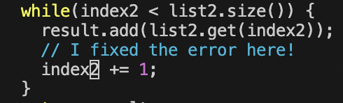
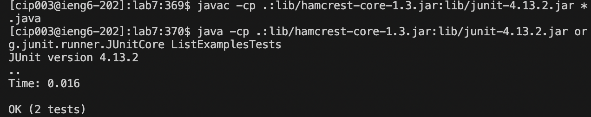
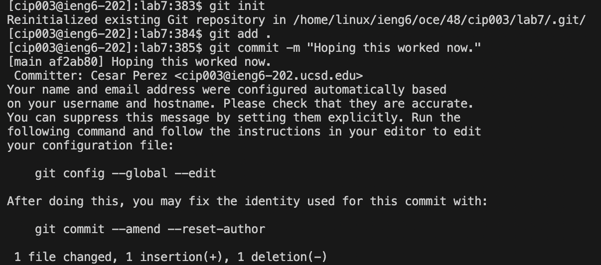
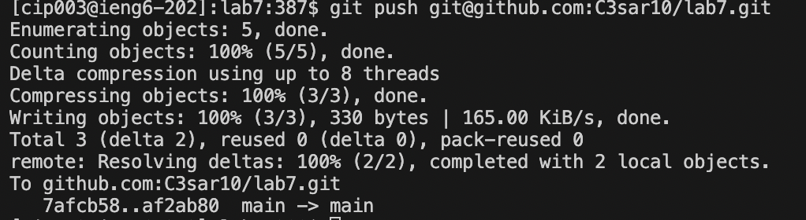
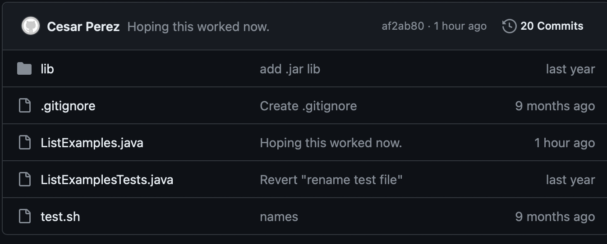

# Lab Report 4 - Vim (Week 7)
---
### Here are the steps we must complete:
1. Log into ieng6
2. Clone your fork of the repository from your Github account (using the SSH URL)
3. Run the tests, demonstrating that they fail
4. Edit the code file to fix the failing test
5. Run the tests, demonstrating that they now succeed
6. Commit and push the resulting change to your Github account (you can pick any commit message!)

   1. Log into ieng6
      
      - The keys I pressed here were: `ssh<space>cip003@ieng6.ucsd.edu<enter>`
      - After I do not have to press anything else because from previous labs I log into my `ieng6` account without having to input a password.
     
   2. Clone your fork of the repository from your Github account (using the SSH URL)
      
      - The keys I pressed were: `git<space>clone<space><control+c><control+v><enter>`
      - So inputing the `git clone` command for the ssh url from my `lab7` repository on git hub allowed me to clone the repository to the ieng6 server. The `<control+c>` and `<control+v>` allowed me to copy paste the ssh url from github to the command line, then I pressed `<enter>` to run the command. 
     
   3. Run the tests, demonstrating that they fail
      
      - The keys pressed here were: `<control+c><control+v><enter><control+c><control+v><space>ListExamplesTests<enter>`
      - Here what is happening is that the first `javac` command is purely copy and pasted from previous lab programs and then `<enter>` is hit to run the command. Then the next `java` command is also copy pasted from previous lab programs however there is a `<space>` added at the end where the class of `ListExamplesTests` is inputed to run the `java Tests` we wish to run to see if the required methods are successful or if they fail. In this case they fail.
     
   4. Edit the code file to fix the failing test
      
      
      
      - The keys pressed here were: `vim<space>ListExamples.java<j(43 times)><l(11 times)><x><i><2><esc><:><w><q><enter>cat<space>ListExamples.java<enter>`
      - Here what is happening is that in order to edit the file `ListExamples.java` we want to open vim which is a text editor so we write `vim ListExamples.java` to edit the file. Now in order to get to the certain character we want to change we must traverse the file by moving the curse down 43 lines and to the right 11 spaces which is done by pressing the `<j>` key 43 times and the `<l>` key 11 times. Now we delete the character at the specific spot with `<x>`, and enter insert mode to add our own character of `<2>`. Then we escape insert mode my pressing `<esc>`, and save the changes we made to the file with `<:><w><q>` which saves the changes and exits vim. Now we just make sure we can see the new changes by running the command `cat ListExamples.java`.
     
   5. Run the tests, demonstrating that they now succeed
      
      -  The keys pressed here were: `<up><up><up><up><enter><up><up><up><up><enter>`
      -  Here what is happening is that since the `javac` and `java` commands were already in our terminal history, in order to use them again we just have to use the `<up>` arrow four times to get the commands again from the terminal history, and once the first `javac` command is run we must do `<up>` four times again for the same reason and hit `<enter>` to run. Then from the output we see that the changes we made in step 4 worked and the tests now pass.
     
   6. Commit and push the resulting change to your Github account (you can pick any commit message!)
       
       
       
      - The keys pressed here were: `git<space>init git<space>add<space>.<enter> git<space>commit<space><-><m><space><">Hoping this worked now.<"><enter> git<space>push<space><control+c><control+v><enter>`
      - Here what is happening is that the `git init` command initializes a local Git repository. Then `git add .` adds file to local repository. Then `git commit -m "Hoping this worked now."` command commits the file you want to stage in the local Git repository. Finally `git push git@github.com:C3sar10/lab7.git` pushes changes from the local repository we made to Git Hub. Now you can see how on Git Hub my changes were successful and the commit message is there.  
     
   
     
      
