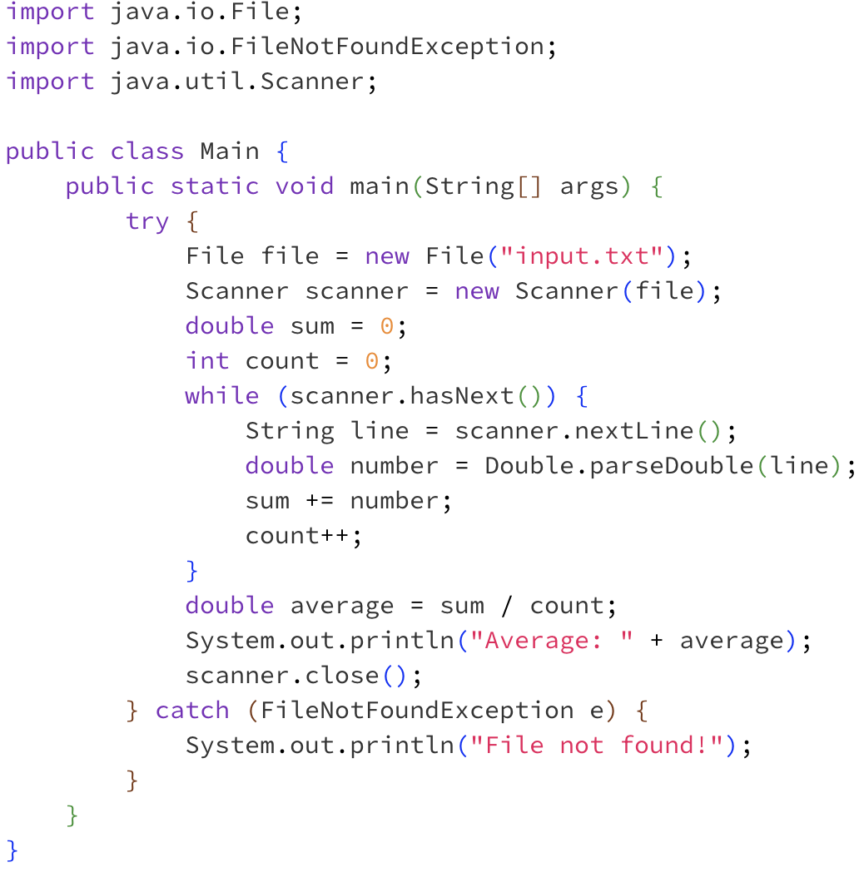
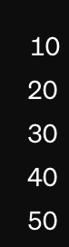
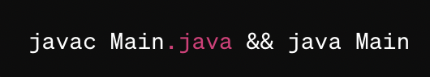
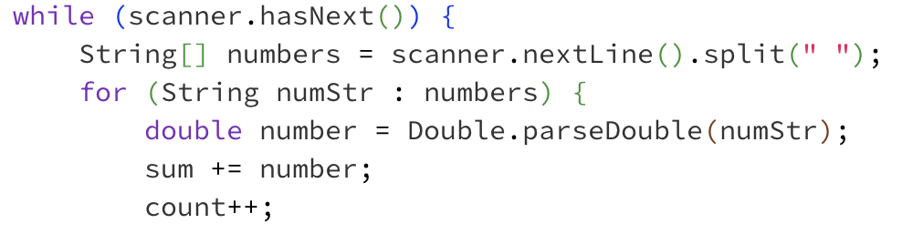

# Lab Report 5
---
## Part 1: Debugging Scenario
---
###  Help! Strange behavior in my Java program #284
Student:

I'm having a weird issue with my Java program. It's supposed to read a list of numbers from a file and calculate their average. However, it seems like the program is not reading the numbers correctly, as it's giving me an average of 0. I've attached a screenshot showing the contents of the input file and the output of my program.

Here's what I think might be the issue: Maybe the program is not reading the numbers correctly from the file?

Any help would be appreciated!

--- 

TA:
Hi there,

Thanks for reaching out! Can you please try printing out each number as it's being read from the file? You can do this by adding a print statement inside your loop where you're reading the numbers. Let me know what you find!

--- 

Student: 

After adding print statements to my code, I realized that it's not reading the numbers correctly from the file. Instead of reading each number individually, it's treating the entire line as a single number, which is causing the average to be calculated incorrectly. Here was the output: 

---

File & Directory Structure:

  - Main.java: Java file containing the main program.
  - input.txt: Text file containing a list of numbers separated by spaces.

Contents of each file before fixing bug: 

- Main.java:
  
- input.txt:
  

Full Command Line to Trigger Bug:

Description of what to edit to fix the bug:

- To fix the bug, we need to modify the code to split each line into individual numbers before parsing them as doubles. We can achieve this by using the split() method to split the line by spaces and then iterate over each resulting string to parse it as a double. Here's the modified code:
  

## Part 2: Reflection
---
One thing I learned in the second half of this quarter was how to run through a java program without having to add any more code as well as having to run the program over and over again multiple times. With the use of `JDB`, I have learned how to run through a program line by line in order to find out what is occuring at each step in the process. I can also print the values of the local variables at each step that way I do not have to add extra `System.out.print` statments in the program to see what the values are. Also being able to stop at a certain line or method is very time saving as I do not have to wait for the program in it's entirety to finish running which saves time. This whole class has been about learning software tools and techniques that will help me be competent and efficient in my future programming endeavours and the use of `JDB` just stood out to me because I feel like I saw how much time it saved me and how useful it is. I felt like I had a lot to takeaway from this class and feel better preapred for any future projects!
